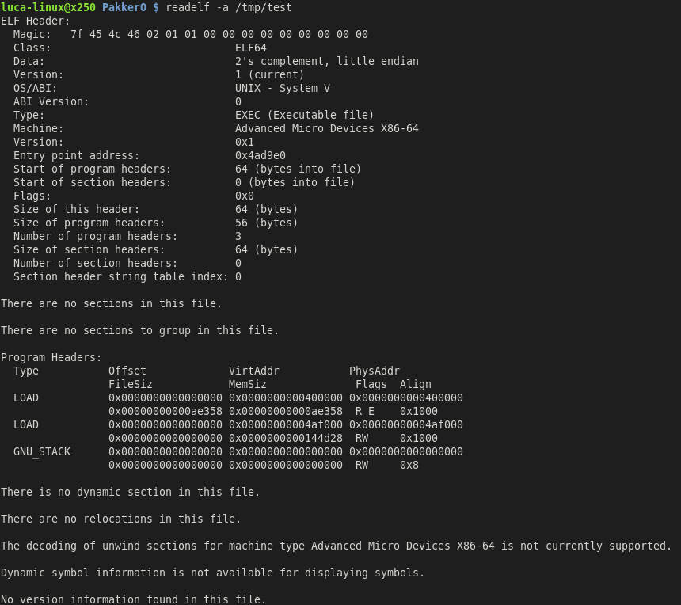
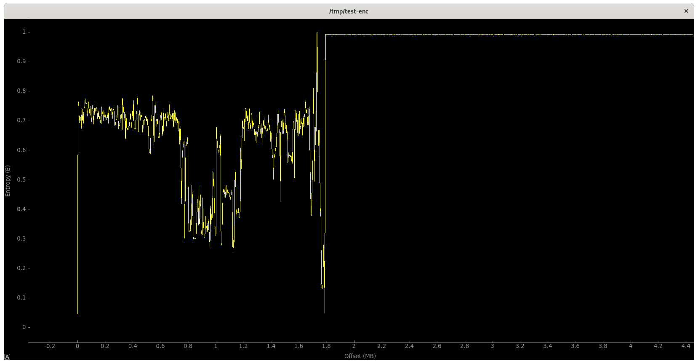
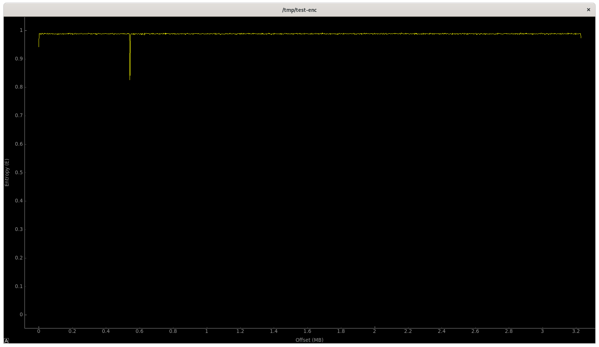

# Pakker0


Credit: [alegrey91](https://github.com/alegrey91) for the logo! Thanks!

[](http://perso.crans.org/besson/LICENSE.html)


## Introduction

**Pakker0** is a binary paker written in Go made for fun and educational purpose.

PakkerO is divided in two main pieces, the packer part (PakkerO itself) and the
launcher part.

It can be used to protect and launch various type of payloads, from scripts (bash, php, python...) to
elf files.

It is not recommended for very small files as the launcher itself can vary from ~700kb to ~1.7mb depending
on compression. On files above 2.6mb there is convenience:

```
base-bin    1.2M    ->  1.6M
smaller-bin 2.4M    ->  2.3M
small-bin   3.7M    ->  3.0M
medium-bin  25M     ->  16M
big-bin     148M    ->  88M
```

So it's best above 2.5Mb of payload

## Install


If you have a [Go](https://golang.org/) environment ready to go, it's as easy as:

```bash
go get github.com/89luca89/pakkero
```

Once you retrieved you are ready to build:

```bash
go build github.com/89luca89/pakkero
```

The following are hard dependencies:

```
 - go -> to build the launcher
 - ls
 - sed
 - strip -> to strip the launcher
```

The following are weak dependencies

```
 - upx -> needed for launcher compression (optional)
```

**Dependencies are checked at runtime and an error message will specify what is missing**

## Part 1: the packer

PakkerO can be launched like:

```bash
pakkero --file ./target-file -o ./output-file -offset 880000 -register-dep dependency-file -c
```


### Usage

Typing `pakker -h` the following output will be shown:

```
Usage: pakkero -file /path/to/file -offset OFFSET (-o /path/to/output) (-c) (-register-dep /path/to/file)
  -file <file>          Target file to Pack
  -o   <file>           place the output into <file> (default is <inputfile>.enc), optional
  -c                    compress the output to occupy less space (uses UPX), optional
  -offset               Offset where to start the payload (Number of Bytes)
  -register-dep         /path/to/dependency to analyze and use as fingerprint (absolutea, optional)
  -v                    Check pakkero version

```

Below there is a full explanation of provided arguments:

* **file**: The file we want to pack
* **o**: The file output that we will create
* **c**: (optional) If specificed, UPX will be used to further compress the Launcher
* **offset**: The number of bytes from where to start the payload (increases if not using compression)
* **regiser-dep** (optional) Path to a file that can be used to register the fingerprint of a dependency to ensure that the Launcher runs only if a file with similar fingerprint is present
* **v**: Print version

### Packaging

The main intent is to **not alter the payload in any way**, this can be very important
for types of binary that rely on specific order of instructions or relatively fragile timings.

#### Payload

For this purpose the payload is simply encrypted using AES256-GCM, and then compressed
using Zlib

During encryption, some basic operations are also performed on the payload:

- putting garbage random values before and after the payload to mask it
- reverse it and change each byte endianess

Encryption password is the hash SHA512 of the compiled launcher itself together with the
garbage values added to fill the file till the offset, thus providing
some integrity protection and anti-tampering.

#### Offset

The offset will decide **where in the output file the payload starts**.

Put simply, after the launcher is compiled (more on the launcher later), the payload is
attached to it. The offset ensures that the payload can be put anywhere after it.
All the space after the launcher until the payload is filled with random garbage.

Being part of the password itself, greater offset will make stronger the encryption, but
enlarge the final output file.

Optimal value are *at least* 800000 when compression is enabled and 1900000 when disabled.

### Obfuscation

The final thing the packer does is compiling the launcher. To protect some of the foundamental
part of it (namely where the offset starts) the launcher is *obfuscated* and heavily stripped down.

The technique utilized for obfuscating the function and variables name is based on typosquatting:


This is done in a pretty naive way, simply put, in the launcher each function/variable which name has
to be obfuscated, needs to start with the suffix **ob**, it will be then put into a secret map, and
each occurrence will be replaced in the file with a random string of lenght 128, composed only of runes that
have siilar shape, namely:

```
	mixedRunes := []rune("0OÓÕÔÒÖŌŎŐƠΘΟ")
```

For pure strings in the launcher, they are detected using regular expressions, finding
all the words that are comprised between the three type of ticks supported in go

```
`
'
"
```

All of the strings found this way, are then replaced with a function that performs simple bitshifts to return
the original char value,

so a string becomes for example

```
func ƠÔƠΘƠΘÓÒ . . . . ÓƠŐƠŌŎÕÒΟŌÔ() string {
	EAX := uint8(Ö0ΟÖΟŐŌŐŐŎÖŌÕ . . . .ÓOΘ0ΟŌŐŎŌÖÓÕƠ0ΟŎƠ.Sizeof(true))
	return string(
		[]byte{
			(((EAX<<EAX^EAX)<<EAX<<EAX|EAX)<<EAX | EAX) << EAX << EAX,
			(((EAX<<EAX^EAX)<<EAX|EAX)<<EAX<<EAX | EAX) << EAX << EAX,
			(((EAX<<EAX^EAX)<<EAX|EAX)<<EAX<<EAX<<EAX | EAX) << EAX,
			((EAX<<EAX^EAX)<<EAX<<EAX<<EAX<<EAX<<EAX | EAX),
			(((EAX<<EAX^EAX)<<EAX<<EAX<<EAX<<EAX|EAX)<<EAX | EAX),
			(((EAX<<EAX^EAX)<<EAX<<EAX<<EAX|EAX)<<EAX<<EAX | EAX),
		},
	)
}

```
credits for the string obfuscation part goes to [GH0st3rs](https://github.com/GH0st3rs/obfus)  Thanks!
as my implementation is started from that and tweaked to work in my workflow.

File is the **stripped**, using obviously **strip** with the flags:

```
	-sxX
	--remove-section=.bss
	--remove-section=.comment
	--remove-section=.eh_frame
	--remove-section=.eh_frame_hdr
	--remove-section=.fini
	--remove-section=.fini_array
	--remove-section=.gnu.build.attributes
	--remove-section=.gnu.hash
	--remove-section=.gnu.version
	--remove-section=.gosymtab
	--remove-section=.got
	--remove-section=.note.ABI-tag
	--remove-section=.note.gnu.build-id
	--remove-section=.note.go.buildid
	--remove-section=.shstrtab
	--remove-section=.typelink
```

Additionally, if using *UPX*, their headers are **removed and replaced with randomness**, to ensure simple
things like `upx -d` will not work.

Additionally a series of extra words are removed from the binary, to make it harder to do static analysis:

```
	.gopclntab
	.go.buildinfo
	.noptrdata
	.noptrbss
	.data
	.rodata
	.text
	.itablink
	.shstrtab
	.data
	.dynamic
	.dynstr
	.dynsym
	.gnu.version_r
	.gopclntab
	.got.plt
	.init_array
	.interp
	.itablink
	.rela.dyn
	.rela.plt
	.tbss
	.plt
	.init
	name runtime command cmd
	ptr process unicode main
	path get reflect context
	debug fmt sync sort
	size heap fatal call
	fixed slice bit file
	read write buffer encrypt
	decrypt hash state
	external internal float
	env trace pid
```

Output of readelf to see the effect:



#### File Entropy

Using binwalk to analyze the file entropy can give some hint on how the process works:

This is the entropy of a packaged binary **without compression**



This is the entropy of a packaged binary **with compression**



In both cases (but mainly the first) it is possible to see when the launcher stops and
the payload starts. This is really not a problem, because the offset of garbage is
both preponed **and** postponed to the payload, and the "secret number" of when it starts is
kept inside the launcher in an obfuscated form (like shown before)

This is obviously vulnerable, reversing the binary will reveal the secret,
all the launcher part is dedicated to the implementation of a series of measures to **block dynamic analysis** and
try to force static analysis.

## Part 2: the launcher

The launcher is the second part of the project an


### Anti-debug

### BFD Study

### Decryption

### Execution
